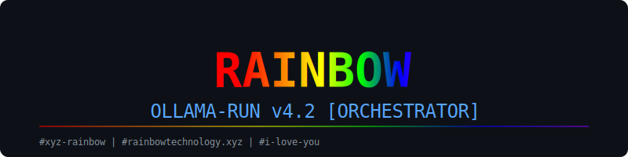

# 🌈 Rainbow Ollama-Run v4.2

Un orquestador avanzado para **Ollama** con soporte nativo de **Tools (Function Calling)**, interfaz interactiva y visualización de pensamiento en tiempo real.



## 🚀 Características
- **Herramientas Integradas:** Búsqueda web (DuckDuckGo), Ejecución de Shell, Integración con Logseq y Estado del Sistema.
- **Selector Interactivo:** Navega y selecciona tus modelos locales con las flechas (**↑** **↓**).
- **Thinking Modes:** Controla el nivel de razonamiento (`OFF`, `ON`, `FORCE`).
- **Live Streaming:** Visualiza el monólogo interno del modelo en tiempo real (Cyan) y la respuesta final (Verde Lima).
- **Instalación Global:** Accede desde cualquier terminal con el comando `ollama-run`.

## 🛠️ Instalación
1. Asegúrate de tener Ollama corriendo (`ollama serve`).
2. Instala las dependencias:
   ```bash
   pip install ollama duckduckgo-search psutil
   ```
3. Ejecuta el orquestador:
   ```bash
   ollama-run
   ```

## ⚙️ Configuración
Dentro del chat, usa el comando `/settings` para cambiar de modelo o ajustar el modo de pensamiento.

---
#xyz-rainbow | #xyz-rainbowtechnology | #rainbowtechnology.xyz
